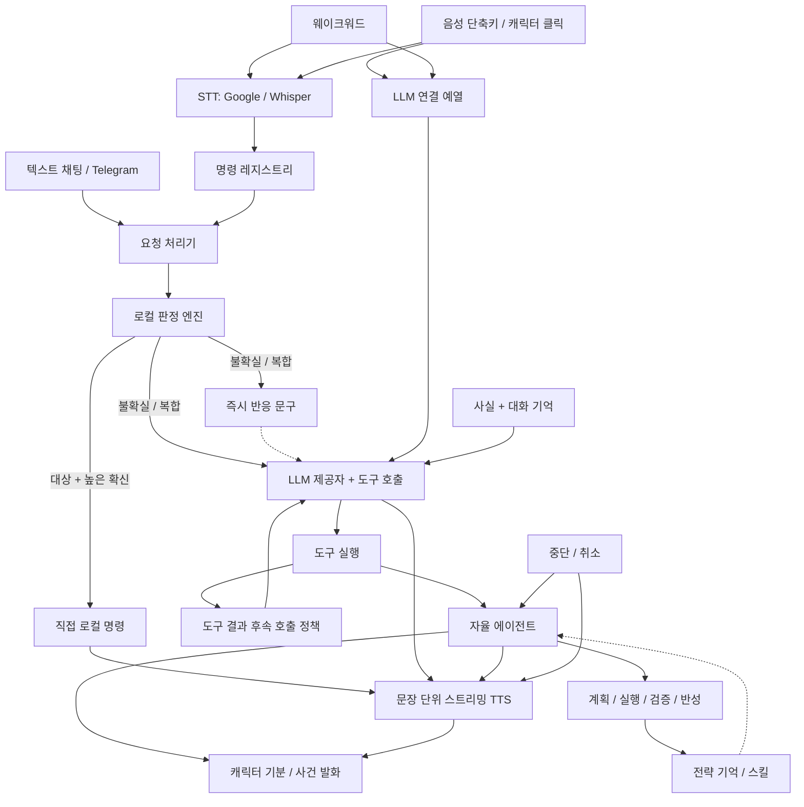

# 문서 모음

아리(Ari) 프로젝트 문서를 한곳에 모았습니다.
README가 프로젝트의 첫인상이라면, 이 문서는 필요한 문서를 목적에 따라 빠르게 찾아가기 위한 색인입니다.

## 빠르게 시작하기

처음 설치하거나 기본 사용 흐름부터 확인하고 싶다면 아래 문서를 먼저 보세요.

- [프로그램 사용 가이드](./USAGE.md) — 실행, 기본 사용법, 로컬 설치(Ollama/CosyVoice3), 자동화 예시, NVIDIA NIM, OpenAI 호환 제공자 추가
- [기여 가이드](./CONTRIBUTING.md) — 검증 명령, 브랜치·커밋 규칙, i18n 체크리스트와 번역 금지 문자열, 로컬 산출물 관리

## 최근 문서화된 변경 포인트

v1.3.3에서는 지난 업데이트 안내 정리, 로컬 판단 모델 다시 불러오기, 기억 색인 정합, 프로필 저장 위치 변경을 더했습니다. v1.2.2~v1.3.2의 변경도 아래에 함께 정리돼 있습니다.

- 실행 중인 버전과 같거나 낮은 대기 업데이트의 안내를 띄우지 않고 지우는 동작, 에이전트 탭의 로컬 판단 모델 상태 표시와 `모델 다시 불러오기`의 즉시 읽기
- "잊어줘" 때 일일 요약까지 검색 색인에서 지우는 동작, 시작 시 사실·선호 색인 맞춤, 색인 재구성 때 대화·일일 요약 보존, 프로필 통계의 `user_context.json` 저장, 에피소드 기억·학습 지표·플래너 피드백의 원자적 저장, 예전 실행 폴더에서 기억 제안·기분 상태·전략 임베딩 가져오기
- 이전 실행에서 받기 시작한 파일을 다운로드 결과에서 제외하는 동작, 변수에 담아 넘긴 삭제 명령의 판정, 제공자 없이 남은 API 키를 지우는 버튼, 프록시 이름 재시도를 끄는 `ARI_PROXY_NAME_FALLBACK`, 원자적 저장이 하드 링크와 파일 권한을 유지하지 못하는 점
- 프록시 환경에서도 확인한 공개 IP로만 요청하는 동작, 브라우저가 받은 파일만 다운로드 결과로 돌려주는 동작, 도중에 끊긴 스킬 업데이트를 다음 시작 때 되돌리는 동작
- 네트워크 도구가 공개 주소로만 요청하고 응답 크기를 제한하는 동작, 브라우저 자동화의 로컬 주소 처리
- Google 계정 연결·해제 절차와 보호된 토큰 저장, 도구 사용 설정의 적용
- 게임 모드가 저장된 TTS 설정을 바꾸지 않는 동작과 마이크 자동 재연결
- "잊어줘"가 지우는 범위, 예약·설정 파일 손상 시 백업
- 베타 채널의 정식판 안내와 플러그인 신뢰 모델
- 설정 창을 작게 줄여도 에이전트·확장·학습·활동 반응·업데이트 탭을 스크롤해 볼 수 있는 동작
- LLM 제공자·모델 변경이나 OpenAI 호환 제공자 추가를 저장하면 재시작 없이 다음 대화부터 반영되고, 대화 기록과 플러그인 등록 도구를 유지하는 동작
- CosyVoice 설치 버튼이 64비트 Python 3.11, 3.10을 순서대로 찾으며 다른 버전만 있으면 필요한 버전을 안내하고 기존 Python은 유지하는 동작
- 마이크 자동 감도 조정을 기본으로 끄고 기존 사용자도 한 번 끄며, 마지막 보정 감도를 수동 값으로 이어 쓰고 1 미만·비숫자 값은 불러올 때마다 300으로 되돌리는 동작
- 빠른 로컬 처리(fast 모드·직접 처리)를 기본으로 켜고, 이전에 끄기를 고른 사용자도 한 번 fast로 옮기는 설정 이전
- 릴리스를 `Ari-Setup-<버전>.exe` 설치 파일 하나로 배포하고, 설정과 기록을 `%AppData%\Ari`에 두는 구성
- 빠른 로컬 처리의 배포 전 확인 절차(후보 문장 사람 검수, 텍스트·실행 파일·음성 확인)와 배포 검사 기준
- 설정에서 OpenAI 호환 제공자를 직접 추가하는 방법과 그 키의 보관 위치
- 사용자가 직접 요청했을 때만 컴퓨터를 끄는 전원 명령 판정과, 추론 모델의 추론 문장을 답변에서 빼는 동작
- Telegram 브리지가 이번 요청에서 도구가 실제로 만든 이미지만 전송하도록 범위를 좁힌 동작
- 4096자를 넘는 Telegram 응답을 잘라내지 않고 나눠 보내는 동작
- 로컬 MCP 서버의 토큰·Host/Origin 검사와 파일 경로 허용 목록 설정
- 설정 파일 원자적 저장, 타이머 경합 수정 등 안정성 관련 동작 기준선
- 텍스트 채팅 말풍선은 줄바꿈된 본문 높이만큼 늘어나며, 캐릭터 말풍선은 최근 8줄만 보이고 앞부분을 줄임표로 줄이며 굵게·제목·코드 표시를 숨기는 동작
- 텍스트 채팅 응답 중 깜박임과 폭 확장을 막고, 긴 제안 칩은 말줄임·툴팁으로 표시하며 진행 패널 설명은 줄바꿈하는 동작
- 로컬 TTS 응답 중단 뒤 CosyVoice를 다시 불러오지 않고, 준비 중 첫 발화 실패와 게임 모드 화면 정지를 막으며 재준비 실패 뒤 지연이 반복되지 않는 동작
- 예약이 가득 차도 일시중지한 예약은 보존하고, 완료된 일회성 예약만 정리하는 동작
- 플러그인 재로드 때 이전 메뉴 항목과 도구를 정리해 중복을 막고, 설치본 Python 도구 WinError 6과 설정 탭 입력 칸 표시를 수정하는 동작
- 마이크 없이 텍스트 채팅을 시작하는 경로와 장치·음성·LLM·TTS 진단, 기존 인스턴스 표시 및 설치 버전·업데이트 알림
- 웨이크워드와 명령을 한 번에 말하기, 전역 단축키·캐릭터 클릭 듣기, 응답 중단, 문장 단위 TTS 재생과 감정 반영
- 캐릭터 말풍선을 프레임의 불투명 영역 윗선에 맞추고 감정 이모지를 제거하는 동작, 의미 없는 응답 끝 기호 정리와 정상 문장 부호 보존
- Fish Audio·ElevenLabs의 첫 오디오 조각 재생, 공통 TTS 볼륨, 복제 추가 인증 안내, 실패 알림과 API 키 로그 가림
- 설치되지 않은 앱 이름이 알려진 사이트와 정확히 일치할 때 기본 브라우저로 여는 처리와 도구 실패 보고
- 기억해·잊어줘 명령, 승인 후 저장하는 기억 후보, 한국어·일본어 검색, 관련 사실 주입과 일일 대화 요약
- 활동 반응·지속되는 기분·사건 기반 짧은 발화, 시스템 프롬프트의 대화 상황 정보
- 사용자 플러그인의 최초·변경 파일 동의와 기본 비활성 핫 리로드, 로컬 ONNX 임베딩과 원격 임베딩 선택
- 에이전트 학습 기여도 진단과 단순 도구 결과의 후속 호출 정책
- 대형 모듈을 기능 단위로 나눈 구조(`agent/planner/` 패키지 등)
- 번역 대상 문자열과 언어별 발화 키워드, 한국어 원문으로 비교하는 키워드·실행 결과 프로토콜의 구분 기준
- `_()` 리터럴 번역의 세 `.po` 검증, 언어별 발화 키워드의 부분 일치 오탐 방지, 번역 함수 이름 가림 방지와 Qt 테스트 GC 정리 기준
- 짧은 명령을 LLM 호출 전에 로컬에서 분류하는 경로와, 확신이 낮으면 기존 경로로 넘기는 기준
- 인증값을 설정 파일에서 분리해 환경변수·암호화 저장소에 보관하고 기존 값을 자동으로 옮기는 동작

자기개선 루프가 바뀌면서 아래 항목의 문서 기준선도 같이 맞췄습니다.

- 실패 반성 결과를 동일 실행 재시도에 주입하는 자율 실행 흐름
- 성공 시 background reflection, 실패 시 동기 reflection 재시도 흐름
- shared context 캐시 기반 Episode Memory / Goal Predictor 1회 조회 재사용
- 목표 난이도 기반 재계획 반복 횟수 동적 조절
- 동일 재계획 이유 / 동일 오류 시그니처 조기 종료
- LLM 수정 → 단순화 → optional 단계 스킵으로 이어지는 회복 전략 다변화
- LearningMetrics lift 기반 컴포넌트 조건부 활성화
- 임베딩 기반 스킬 매칭과 컴파일 실패 추적
- 주간 보고서의 학습 컴포넌트 통계 / 신규 스킬 / Python 컴파일 / 추정 토큰 표시
- ko/en/ja 3개 언어 동시 반영을 전제로 한 i18n 유지 절차

캐릭터 위젯 확장 기능 쪽 기준선도 함께 반영했습니다.

- 마켓플레이스 플러그인 설명·배포와 맞물리는 사용자 문구 및 가이드
- 사용자 플러그인 파일 승인 절차와 핫 리로드 설정 기본값
- 트레이 메뉴 기준 접근 경로와 커스텀 메시지 관리 흐름
- 플러그인 ZIP을 마켓플레이스로 따로 배포하고 런타임 폴더에 설치하는 운영 규칙

## 확장과 커스터마이징

앱 기능을 늘리거나 외형을 손볼 때는 아래 문서를 참고하세요.

- [프로그램 사용 가이드 - Agent Skills / MCP](./USAGE.md#4-에이전트-스킬-skills--mcp) — Agent Skills 설치, MCP 스킬 사용 흐름, 관리 UI
- [로컬 MCP 서버](./MCP_SERVER.md) — Ari 도구를 외부 클라이언트에서 호출하는 HTTP 엔드포인트
- [Telegram 원격 명령](./USAGE.md#telegram-원격-명령) — 허용된 채팅에서 Ari 명령을 원격 실행하는 브리지 설정
- [플러그인 가이드](./PLUGIN_GUIDE.md) — 훅(메뉴·명령·도구·샌드박스) 등록, API 버전, ZIP 패키지 구조, 코드 예시
- [자율 에이전트 고급 기능](./AGENT_ADVANCED.md) — 대화 문맥, 기억 검색·제안, 활동 반응, 임베딩 선택과 학습 진단
- [테마 커스터마이징 가이드](./THEME_CUSTOMIZATION.md) — 팔레트 에디터와 JSON 테마 파일 편집 방법, `DNFBitBitv2` 폰트 출처
- [캐릭터 이미지 가이드](./CHARACTER_IMAGES.md) — 애니메이션 이미지 파일명 규칙, 감정 표현 시스템

## 동작 구조

## 로컬 판정 평가 결과

로컬 판정 엔진의 지원 명령 경로에는 별도의 홀드아웃 평가가 있습니다.

- 생성 평가 문장 **7,407개**
- 파서 확인 직접 선택 **367건**
- 해당 선택의 **측정 정밀도 100.0%**
- 이 평가에서 **잘못된 직접 선택 0건**
- AMD64 Windows 데스크톱 1,000회 웜 추론: **p50 0.048ms**, **p95 0.071ms**

이 수치는 판정기/파서 경로만 평가합니다. 마이크 음성 인식 정확도, 전체 에이전트 성공률, 모든 종류의 사용자 요청을 의미하지 않습니다.

## 개발 및 운영 참고

실행 경로와 검증 흐름을 빠르게 확인할 때 보는 메모입니다.

- [로컬 결정 엔진](./LOCAL_DECISION_ENGINE.md) — 단계별 도입 계획, 다국어 평가, 신뢰도 보정과 안전한 명령 라우팅
- [로컬 결정 데이터 작업 순서](../VoiceCommand/scripts/decision_data/README.md) — 판정 데이터, 평가 산출물과 배포 전 사람 검수 절차
- [빠른 로컬 처리 배포 전 확인](./LOCAL_DECISION_ACCEPTANCE.md) — 후보 문장 검수, 텍스트·실행 파일·음성 확인 절차와 기록 양식
- [로컬 판정 자원 배포 기록](./LOCAL_DECISION_DEPLOYMENT.md) — 직접 처리 표현 보강 결과와 이전 배포 판정
- [API 키 보관](./CREDENTIALS.md) — 환경변수, 암호화 저장소, 자동 이전 및 복구 기준

### 운영 메모

- 소스로 실행하면(`VoiceCommand\.venv\Scripts\python.exe VoiceCommand\Main.py`) 런타임 상태가 `VoiceCommand/.ari_runtime/`에 쌓입니다.
- 빌드된 exe로 실행하면 같은 상태가 `%AppData%/Ari/`에 쌓입니다.
- `reference.wav`는 소스·테스트 실행에서는 런타임 경로를, exe 실행에서는 `%AppData%/Ari/` 경로를 먼저 찾습니다.
- `VoiceCommand/validate_repo.py`는 compile + unittest에 더해 clean runtime 환경과 marketplace SHA256 계약 smoke까지 확인합니다.

